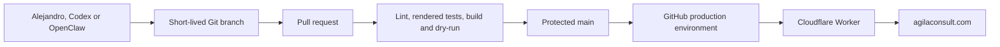

# Website architecture

## Decision

The first production release uses a server-rendered React application deployed
as a Cloudflare Worker with static assets. It preserves the strongest wedding
site patterns, such as typed content, Git-based publishing, Cloudflare delivery
and deterministic CI, while improving SEO, security headers, canonical routing
and fail-closed deployment.

No backend is needed in this iteration. Direct email is the contact path, Git is
the content system, and the public site stores no visitor data.

## System view

## Runtime

- Vinext compiles the Next.js-compatible app router to Cloudflare-compatible
  ESM.
- The Worker server-renders the home and legal routes and serves fingerprinted
  client assets.
- The Worker adds content security, clickjacking, MIME, referrer, browser
  feature and transport headers.
- Content-hashed assets are cached immutably; HTML revalidates.
- Search discovery uses canonical metadata, Open Graph, JSON-LD, `robots.txt`
  and `sitemap.xml`.

## Content architecture

`app/content.ts` is the stable, typed editing surface for navigation,
capabilities, method, delivery model, selected experience and contact signals.
This keeps routine copy changes separate from layout and deployment code and is
the main safe surface for future OpenClaw updates.

The legal page stays separate because company identifiers and privacy wording
need a higher approval threshold than marketing copy.

## Security and privacy

- No browser analytics or advertising tags
- No cookies, sign-in, database, form submission or public API
- No external font request at runtime
- CSP, HSTS, frame denial, referrer and permissions policies at the Worker edge
- Public-repository instructions prevent client, financial, CRM and evidence
  data from entering the repository
- Production credentials isolated in the GitHub `production` environment

## Deliberate omissions

The first release has no empty insights section, CMS, newsletter, calendar
embed, chatbot, contact form or interactive ontology explorer. Each would add
maintenance, privacy or content-governance cost without strengthening the
immediate positioning goal. They can be added sequentially when a real content
owner and acceptance criteria exist.
