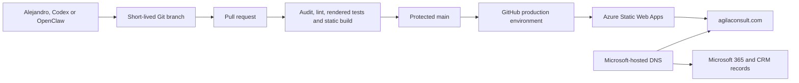

# Website architecture

## Decision

The production site is a static Next.js export hosted by Azure Static Web Apps.
Microsoft continues to register the domain, host its authoritative DNS and
provide Microsoft 365 email. Only the apex and `www` website records point to
Azure; the existing email, Teams, device-enrollment and CRM records are left
unchanged.

No backend is needed in this iteration. Direct email is the contact path, Git is
the content system, and the public site stores no visitor data.

## System view

## Runtime

- Next.js exports the home, legal and not-found pages to the `out` directory.
- Azure Static Web Apps serves the static pages and fingerprinted client assets.
- `public/staticwebapp.config.json` defines routing, caching and browser-security
  headers at the Azure edge.
- Content-hashed assets are cached immutably.
- Search discovery uses canonical metadata, Open Graph, JSON-LD, `robots.txt`
  and `sitemap.xml`.

## Content architecture

`app/content.ts` is the stable, typed editing surface for navigation,
capabilities, method, delivery model, selected experience and contact signals.
This keeps routine copy changes separate from layout and deployment code and is
the main safe surface for future OpenClaw updates.

The legal page stays separate because company identifiers and privacy wording
need a higher approval threshold than marketing copy.

## Security and privacy

- No browser analytics or advertising tags
- No cookies, sign-in, database, form submission or public API
- No external font request at runtime
- CSP, HSTS, frame denial, referrer and permissions policies at the Azure edge
- HSTS intentionally excludes `includeSubDomains`, so deployment cannot impose
  transport policy on Microsoft 365, CRM or other independent subdomains
- Public-repository instructions prevent client, financial, CRM and evidence
  data from entering the repository
- Production credentials isolated in the GitHub `production` environment

## Deliberate omissions

The first release has no empty insights section, CMS, newsletter, calendar
embed, chatbot, contact form or interactive ontology explorer. Each would add
maintenance, privacy or content-governance cost without strengthening the
immediate positioning goal. They can be added sequentially when a real content
owner and acceptance criteria exist.
