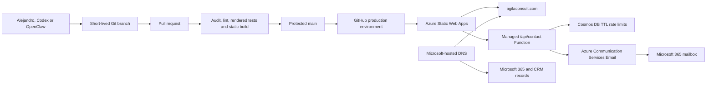

# Website architecture

## Decision

The production site is a static Next.js export hosted by Azure Static Web Apps.
Microsoft continues to register the domain, host its authoritative DNS and
provide Microsoft 365 email. Only the apex and `www` website records point to
Azure; the existing email, Teams, device-enrollment and CRM records are left
unchanged.

The contact experience uses a narrowly scoped managed Azure Function. It
validates enquiries, applies durable abuse controls and submits a fixed-recipient
plain-text email through Azure Communication Services. Git remains the content
system. Form contents are not written to a website contact database.

## System view

## Runtime

- Next.js exports the home, capabilities, legal and not-found pages to the `out`
  directory.
- Azure Static Web Apps serves the static pages and fingerprinted client assets.
- A managed Node 22 Azure Function serves only the contact endpoint under
  `/api/contact`; GET exists solely as a controlled 405 health probe.
- Azure Communication Services accepts plain-text website enquiries for the
  fixed mailbox held in the protected `CONTACT_RECIPIENT_ADDRESS` setting. The
  visitor address is used only as `Reply-To`, and the API waits for the Azure
  send operation to succeed before returning HTTP 202.
- Cosmos DB stores HMAC-derived abuse keys and counters with item-level TTL; it
  never stores the enquiry content or raw visitor address.
- `public/staticwebapp.config.json` defines routing, caching and browser-security
  headers at the Azure edge.
- Content-hashed assets are cached immutably.
- Search discovery uses canonical metadata, Open Graph, JSON-LD, `robots.txt`
  and `sitemap.xml`.

## Content architecture

`app/content.ts` is the stable, typed editing surface for navigation,
capabilities, method, delivery model, selected experience and contact signals.
This keeps routine copy changes separate from layout and deployment code and is
the main safe surface for future OpenClaw updates.

The legal page stays separate because company identifiers and privacy wording
need a higher approval threshold than marketing copy.

The capabilities page renders a complete semantic HTML taxonomy and enhances it
with a route-only Force Graph canvas. A D3 force simulation clusters the six
public domains while client-side search, semantic-detail views and shareable
focus hashes preserve direct navigation. The homepage teaser is static and does
not load Force Graph or the public ontology. A positive-schema validator blocks
private fields, names, dangling relationships and unexpected model changes
before the static build runs.

## Security and privacy

- No browser analytics or advertising tags
- No cookies, sign-in, analytics or contact-form database
- Exact production-origin checks, a hidden honeypot, strict server validation,
  32 KiB request cap and configuration-fixed sender/recipient/subject
- Atomic limits of 3 submissions per source per 15 minutes, 10 per source per
  24 hours and 30 sends globally per 24 hours, plus 10-minute deduplication
- Rate-limit identifiers are HMAC-derived and expire automatically within 24
  hours; email contents never enter application logs
- Azure credentials are encrypted Static Web Apps settings and are unavailable
  to the browser, repository and GitHub build output
- Azure Communication Services engagement tracking remains disabled
- No external font request at runtime
- CSP, HSTS, frame denial, referrer and permissions policies at the Azure edge
- HSTS intentionally excludes `includeSubDomains`, so deployment cannot impose
  transport policy on Microsoft 365, CRM or other independent subdomains
- Public-repository instructions prevent client, financial, CRM and evidence
  data from entering the repository
- Production credentials isolated in the GitHub `production` environment

## Deliberate omissions

The site still has no empty insights section, CMS, newsletter, calendar embed or
chatbot. The public capability explorer is deliberately presentation-only: it
has no external data calls, account, analytics, data-entry or access to the
private canonical ontology. The contact backend remains single-purpose and
cannot send to a visitor-controlled recipient.
